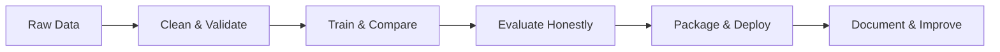

<div align="center">

# Joel Raju

### AI & Big Data · Machine Learning · Data Engineering

Computer Science student building practical intelligent systems—from low-resource NLP and distributed analytics to computer vision and AI-assisted learning tools.

[](https://joel-cdev.github.io)
[](https://github.com/joel-cdev)
[](#lets-connect)

</div>

---

## About me

I'm a Computer Science student at the **University of Wollongong in Dubai**, specializing in **AI and Big Data**. I enjoy turning research questions into working, reproducible systems with clear evaluation, honest limitations, useful interfaces, and documentation another developer can follow.

```text
focus      applied NLP · data engineering · responsible AI · production ML
approach   experiment → evaluate → deploy → document
location   Dubai, UAE
```

## Tech stack

<p align="center">
  
</p>

<div align="center">


</div>

## Featured projects

<table>
<tr>
<td width="50%" valign="top">

### 🗣️ [Code-Mixed Sentiment Analysis](https://github.com/joel-cdev/low-resource-malayalam-codemix-transfer-learning)

**NLP · mT5 · LoRA · FastAPI · Docker**

Compared full fine-tuning with parameter-efficient LoRA for Malayalam–English sentiment classification.

- **84.62%** test accuracy
- **81.12%** weighted F1
- Evaluated on **702 held-out examples**
- Added code-mix robustness analysis
- Packaged inference as a Dockerized API

</td>
<td width="50%" valign="top">

### 🏙️ [Dubai Real Estate Analytics](https://github.com/joel-cdev/csci316-dld-transactions)

**Apache Spark · ML · Streamlit · Docker**

Built a Spark-native pipeline for Dubai Land Department transaction data.

- Explicit schemas, cleaning, and feature engineering
- Manual **10-fold cross-validation**
- Custom bagging ensemble
- Reproducible output artifacts
- Interactive Streamlit dashboard

</td>
</tr>
<tr>
<td width="50%" valign="top">

### 🧠 [Cognitive Learning Intelligence Platform](https://github.com/ShezinKhais/Cognitive_Learning_Intelligence_Platform)

**Applied AI · Full Stack · Team Collaboration**

Contribute to an AI-powered engagement assistant for live online classes.

- Lecturer material workflows
- Consent and protected-route controls
- Live student-session interfaces
- Microsoft Teams integration
- Reviewed pull-request workflow

</td>
<td width="50%" valign="top">

### 🖐️ [Gesture Presentation Controller](https://github.com/joel-cdev/gesture-presentation-controller)

**Computer Vision · Python · Web App**

Built a computer-vision application that maps hand gestures to presentation controls, combining real-time visual input with a practical user interface.

</td>
</tr>
</table>

## Engineering strengths



- **Machine learning:** experimental design, transformer fine-tuning, evaluation, and error analysis
- **Data systems:** distributed processing, schemas, feature pipelines, and reproducible artifacts
- **Delivery:** REST APIs, containerization, interactive dashboards, and developer documentation
- **Collaboration:** scoped pull requests, code review, protected application flows, and iterative delivery

## GitHub activity

<div align="center">


</div>

## Let's connect

I'm open to **internship and entry-level opportunities** in machine learning, data science, data engineering, and AI software development.

<div align="center">

[](https://joel-cdev.github.io)
[](https://github.com/joel-cdev?tab=repositories)

</div>
